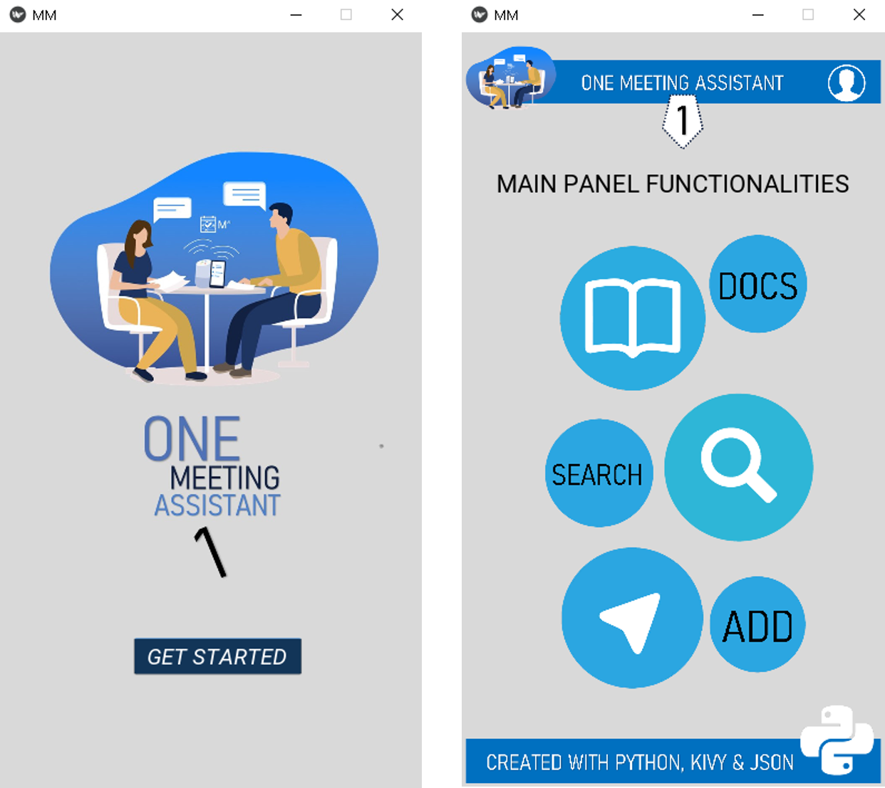
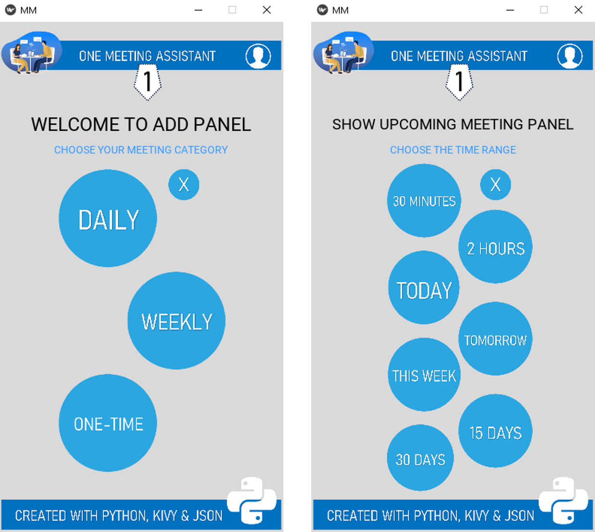
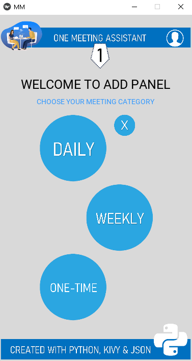
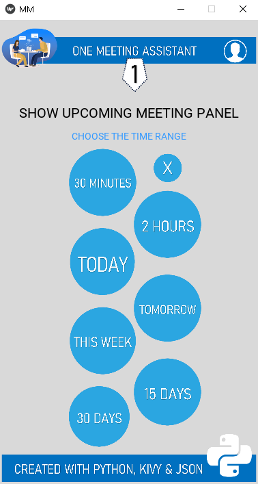
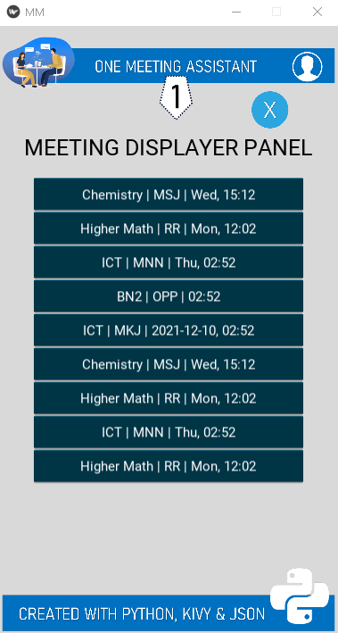
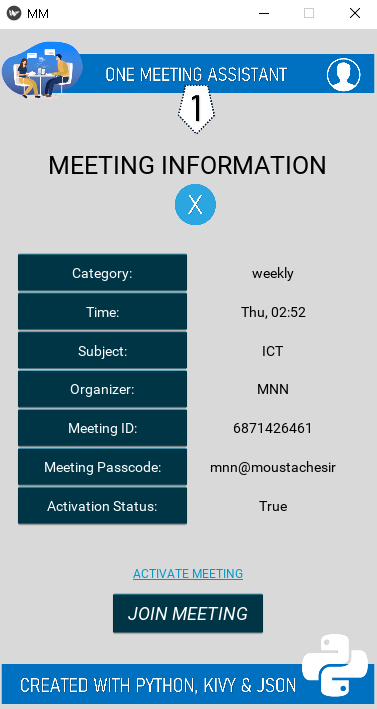

# One Meeting Assistant
One Meeting Assistant is a meeting management tool, designed and created using Python3, Kivy, and JSON. This application has both the FrontEnd and BackEnd part and it is compatible with all kind of video calling platform like Zoom, Meet, Skype, Team etc. If people want to create the FrontEnd part of their own, then they can still use the BackEnd code. 

It was initially designed for the students (Zoom Assistant) who have to attend online classes in the pandemic situation. The most annoying part of online classes is that manually search through the class routine and teacher's meeting ID and password's list before each class. One Meeting Assistant will assist you to complete that work in just 3 seconds!

However, because of the increasing demand for video meetings management tool, I upgraded this application so that it can be used by people of all ages and professions. Lots of new algorithms have been implemented and all the manual tasks have been managed in a way so that they can be completed automatically. 

 

# Features
* Read the Docs about how to use
* Add meetings according to differnt catagories like daily, weekly and one-time.
* Create query and search all the meetings according to the query.
* Search upcoming meetings using multiple time_ranges.
* Deactivate and activate meetings
* Join directly to the meetings from the application.
* Show all past and deactivated meetings.
* clear history of past and deactivated meetings.

# How to Use
* Download and Install [Python 3](https://www.python.org/downloads/) in your device.
* Install the modules mentioned in [requirements.txt](requirements.txt) file
* Download [One Meeting Assistant](https://codeload.github.com/ahammadshawki8/One-Meeting-Assistant/zip/main) repository's zip folder in your device.
* Extract the zip file.
* Open [mm_frontend.py](mm_frontend.py) file.
* Enjoy using this file.
* Don't forget to see the [demo]() video.
* Enjoy using this application.
* If you find any difficulty or have any suggestion for future updates, create an [issue](https://github.com/ahammadshawki8/One-Meeting-Assistant/issues).

 

# Modules & Functions
## [resources](resources)
- contains all pictures which are used in the FrontEnd part of the application.
## [requirements.txt](requirements.txt)
- contains the name of the third party modules and their version numbers which you need to install before running the application in your device.
## [mm_frontend.py](mm_frontend.py) & [mm_frontend.kv](mm_frontend.kv)
- used for the frontend part, contains multiple classes and functions and also glue code.
## [mm_backend.py](mm_backend.py)
- Holder
- json_to_dict
- dict_to_json
- weekday_to_number
- add_meeting
- show_all_meetings
- show_upcoming_meetings
- show_past_meeting
- activate_meeting
- deactivate_meeting
- clear_history
- join_meeting
- go_to_website
- go_to_readme
## [meetings.json](meetings.json)
- Here all the meets and other addtional informations as well as credits have been stored. This file plays a vital role in the total workflow of this application.
## [test.py](test.py)
- currently it is almost blank, I used it to test and debug differnt classes and functions manually.

 

# License
Details can be found in [LICENSE](LICENSE)

 

# Some ScreenShots

  

  

  

  

  
